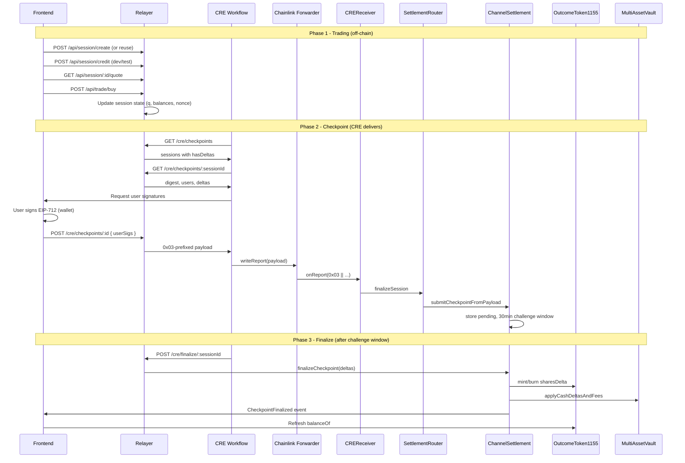

# End-to-End Flow: Frontend, Relayer, CRE, Smart Contracts

**Audience:** All engineers  
**Reference:** [CurrentSmartContract.md](../../../front-end-v2/docs/abi/docs/CurrentSmartContract.md) Section 6 (End-to-End Flows), Section 13 (Practical Production Path)

---

## 1. Overview

This document correlates the **frontend**, **relayer**, **CRE workflow**, and **smart contracts** into a unified flow. Per CurrentSmartContract Section 13, the production lane is:

1. Curated draft proposal → claimAndSeed → Publish via CRE
2. **Trade offchain** (relayer) → settle checkpoints through ChannelSettlement
3. Resolve via oracle path into MarketRegistry
4. Redeem through registry

The relayer sits between the frontend (trading UX) and the CRE workflow (checkpoint delivery). It does **not** interact with Draft/Claim/Publish or oracle resolution directly.

---

## 2. Full Pipeline (Trading + Checkpoint)

---

## 3. Correlation with CurrentSmartContract

### 3.1 Relayer Session vs Smart Contract Concepts

| Relayer Concept | Smart Contract (CurrentSmartContract) |
|-----------------|---------------------------------------|
| sessionId | `ChannelSettlement` session key; `ShadowTypes.Checkpoint.sessionId` |
| marketId | `MarketRegistry.marketId`; `ChannelSettlement` operates per (marketId, sessionId) |
| vaultId | Logical ref; on-chain uses `MarketRegistry.liquidityVaultByMarketId`, `MultiAssetVault`, or `CollateralVault` |
| q (outcome vector) | Mirrors `ExecutionLedger` positions; checkpoint `Delta[]` drives `OutcomeToken1155` mint/burn |
| nonce | `ChannelSettlement` finalized nonce; strictly increasing; replay protection (§9) |
| lastTradeAt | `Checkpoint.lastTradeAt`; must be `<= tradingClose` at finalize (§9.3) |
| stateHash, deltasHash | `ShadowTypes.Checkpoint`; verified on-chain |

### 3.2 CRE Report Routing (CurrentSmartContract §6.1, §6.3)

- **0x01** — Outcome report → `OracleCoordinator.submitResult` → `SettlementRouter.settleMarket` → `MarketRegistry.onReport` (resolve)
- **0x03** — Session report → `OracleCoordinator.submitSession` → `SettlementRouter.finalizeSession` → `ChannelSettlement.submitCheckpointFromPayload`

The relayer only produces **0x03** payloads. Oracle resolution (0x01) is a separate CRE workflow.

### 3.3 Trust Model (CurrentSmartContract §4)

- **ChannelSettlement** trusts: operator signature, user signatures, nonce monotonicity, challenge window
- Relayer holds `OPERATOR_PRIVATE_KEY` (must match `ChannelSettlement.operator`)
- Frontend prompts users to sign; CRE cannot sign on behalf of users

---

## 4. Frontend Responsibilities

| Action | API | Contract / Event |
|--------|-----|-------------------|
| Create/reuse session | `POST /api/session/create` | Align sessionId with market; vaultId from `MarketRegistry` or draft |
| Credit (dev) | `POST /api/session/credit` | Not on-chain; relayer only |
| Get quote | `GET /api/session/:id/quote` | LS-LMSR; same pricing model as whitepaper |
| Place order | `POST /api/trade/buy`, swap, sell | Updates relayer state; no contract call |
| Sign checkpoint | EIP-712 `signTypedData` | Domain: ShadowPool, verifyingContract = ChannelSettlement |
| After finalize | Subscribe events | `ChannelSettlement.CheckpointFinalized`; refresh `OutcomeToken1155.balanceOf` |

---

## 5. CRE Workflow Responsibilities

| Action | API | Contract Call |
|--------|-----|---------------|
| Discover sessions | `GET /cre/checkpoints` | None |
| Get spec | `GET /cre/checkpoints/:id` | Relayer reads `ChannelSettlement.latestNonce` (RPC) |
| Collect sigs | (frontend or service) | None |
| Build payload | `POST /cre/checkpoints/:id` | None |
| Deliver | `writeReport` | Forwarder → CREReceiver → submitCheckpointFromPayload |
| Finalize | `POST /cre/finalize/:id` or direct | `ChannelSettlement.finalizeCheckpoint` |

---

## 6. Related Documents

- [CONTRACT_MAPPING.md](CONTRACT_MAPPING.md) — Relayer ↔ contract field mapping
- [SESSION_LIFECYCLE.md](SESSION_LIFECYCLE.md) — Session vs tradingClose, resolveTime
- [frontend/INTEGRATION_GUIDE.md](frontend/INTEGRATION_GUIDE.md)
- [cre/WORKFLOW_INTEGRATION.md](cre/WORKFLOW_INTEGRATION.md)
