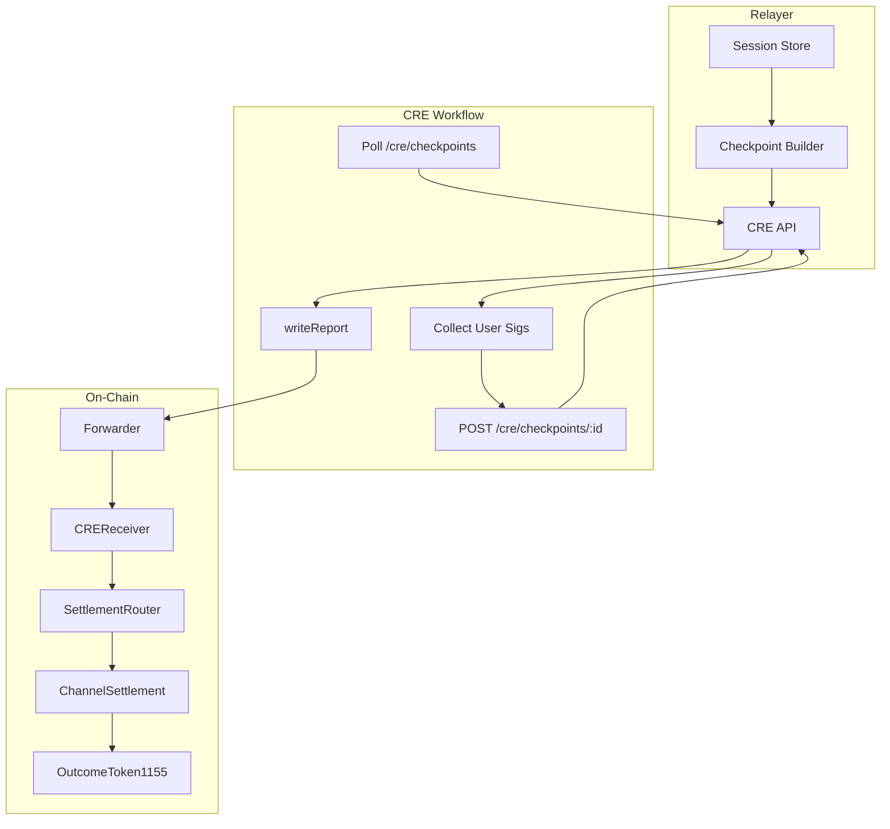

# Relayer-CRE-ChannelSettlement Architecture

**Audience:** Protocol and backend engineers  
**Reference:** [CurrentSmartContract.md](../../../../front-end-v2/docs/abi/docs/CurrentSmartContract.md) Section 2 (Topology), 4 (Trust) | [packages/contracts/README.md](../../../../../packages/contracts/README.md) | [E2E_FLOW.md](../E2E_FLOW.md)

---

## 1. High-Level Pipeline

```
Relayer (session state)
    |
    | GET/POST /cre/checkpoints
    v
CRE Workflow (fetch payload, collect sigs)
    |
    | writeReport(0x03 || payload)
    v
Chainlink Forwarder
    |
    v
CREReceiver
    |
    | report[0] == 0x03 -> submitSession -> finalizeSession
    v
SettlementRouter
    |
    v
ChannelSettlement (submitCheckpointFromPayload, finalizeCheckpoint)
    |
    v
OutcomeToken1155, MultiAssetVault, FeeManager
```

---

## 2. Component Roles

| Component | Role |
|-----------|------|
| **Relayer** | Off-chain trading engine; LS-LMSR pricing; session state; builds checkpoint payloads; serves CRE endpoints |
| **CRE Workflow** | Fetches checkpoint spec and payloads from relayer; collects user signatures; delivers via Chainlink |
| **Chainlink Forwarder** | Trusted entry point; forwards reports to CREReceiver |
| **CREReceiver** | Routes 0x01 (outcome) and 0x03 (session) reports |
| **OracleCoordinator** | Validates and forwards to SettlementRouter |
| **SettlementRouter** | Routes to MarketRegistry (resolve) or ChannelSettlement (checkpoint) |
| **ChannelSettlement** | Verifies operator + user sigs; submitCheckpointFromPayload; finalizeCheckpoint; V3-Escrow reserves |

---

## 3. Checkpoint Settlement (V3)

Per [packages/contracts/README.md](../../packages/contracts/README.md):

```
Off-chain trading (relayer) ->
  Build checkpoint + deltas ->
  Operator + user signatures ->
  CRE fetches payload ->
  CREReceiver.onReport(0x03 || payload) ->
  OracleCoordinator.submitSession ->
  SettlementRouter.finalizeSession ->
  ChannelSettlement.submitCheckpointFromPayload ->
    V3-Escrow: reserve(user, netDebit) per debtor ->
  30min challenge window ->
  finalizeCheckpoint ->
    OutcomeToken1155 mint/burn sharesDelta ->
    applyCashDeltasAndFees ->
    release reserves
```

---

## 4. Data Flow



---

## 5. Trust Boundaries

| Boundary | Enforcement |
|----------|-------------|
| Forwarder | CREReceiver: only Forwarder can call onReport |
| Coordinator | OracleCoordinator: only CREReceiver can call submitResult/submitSession |
| Router | SettlementRouter: only OracleCoordinator can call settleMarket/finalizeSession |
| Checkpoint | ChannelSettlement: operator + every delta user must sign; nonce monotonicity; challenge window |

---

## 6. Relayer Config (Production)

| Variable | Purpose |
|----------|---------|
| CHANNEL_SETTLEMENT_ADDRESS | ChannelSettlement contract (Fuji: 0xFA5D0e64B0B21374690345d4A88a9748C7E22182) |
| OPERATOR_PRIVATE_KEY | Key matching ChannelSettlement.operator for checkpoint signing |
| FINALIZER_PRIVATE_KEY | Optional; defaults to OPERATOR_PRIVATE_KEY for POST /cre/finalize |
| RPC_URL | For nonce sync and finalize tx |
| CHAIN_ID | 43113 (Fuji) |
