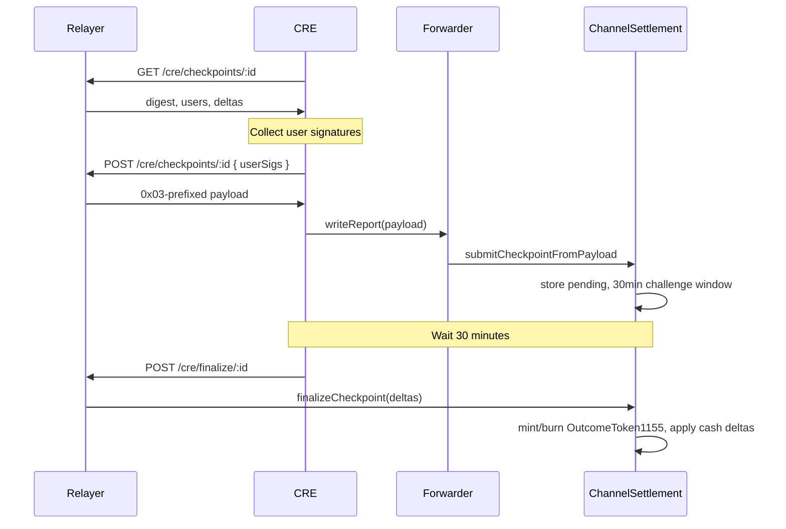

# Checkpoint Flow: Submit, Challenge Window, Finalize

**Audience:** CRE workflow engineers  
**Context:** [CurrentSmartContract.md](../../apps/front-end-v2/docs/abi/docs/CurrentSmartContract.md) | [packages/contracts/README.md](../../packages/contracts/README.md)

---

## 1. Submit Flow

CRE sends the `0x03`-prefixed payload via `writeReport`:

```
evmClient.writeReport(receiver: CREReceiver, report: payload) ->
  Chainlink Forwarder ->
  CREReceiver.onReport(0x03 || abi.encode(...)) ->
  OracleCoordinator.submitSession ->
  SettlementRouter.finalizeSession ->
  ChannelSettlement.submitCheckpointFromPayload
```

**V3-Escrow:** On submit, ChannelSettlement reserves user net-debit amounts in `reserveUsers` and `reserveAmts`. Reserves are released on finalize or cancel.

---

## 2. Challenge Window (30 minutes)

After submit, a 30-minute challenge window begins. During this window:

- **finalizeCheckpoint** reverts (e.g. `TooEarly`, challenge window)
- Users can **challenge** with a newer nonce if they dispute the checkpoint

---

## 3. Finalize (Permissionless)

After `block.timestamp >= challengeDeadline`, **anyone** can call:

```solidity
ChannelSettlement.finalizeCheckpoint(marketId, sessionId, deltas)
```

**Deltas source:** `GET /cre/checkpoints/:sessionId` returns `deltas`.

**Who typically finalizes:**

| Option | Description |
|--------|-------------|
| Relayer finalizer | Relayer exposes `POST /cre/finalize/:sessionId`; submits finalize tx via RPC |
| CRE workflow | Separate cron that checks challenge deadline and submits finalize |
| Bot | Third-party bot watches for challengeDeadline and calls finalize |
| Frontend | User-triggered from UI (requires RPC/wallet) |

**Recommended:** Relayer finalizer or dedicated CRE workflow for automatic finalization.

---

## 4. Cancel Escape Hatch

After `CANCEL_DELAY` (6 hours) from `createdAt`, anyone can call:

```solidity
ChannelSettlement.cancelPendingCheckpoint(marketId, sessionId)
```

Releases stuck reserves if no one finalized (e.g. workflow failure).

---

## 5. Sequence Diagram


