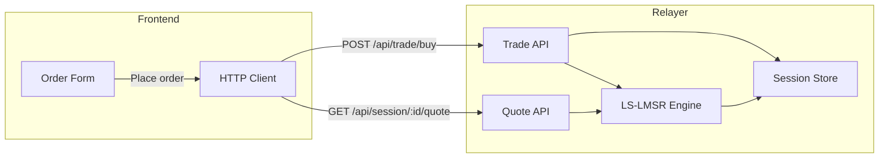

# Relayer Trading API Reference

**Audience:** Frontend engineers  
**Base URL:** `https://backend-relayer-production.up.railway.app`  
**Source:** [apps/relayer/src/api/routes.ts](../../../src/api/routes.ts)  
**Contract correlation:** [CONTRACT_MAPPING.md](../CONTRACT_MAPPING.md) | [CurrentSmartContract.md](../../../../front-end-v2/docs/abi/docs/CurrentSmartContract.md) Section 5.3, 6.3

---

## Overview

The relayer exposes an HTTP API for off-chain (gasless) trading. Sessions use LS-LMSR pricing, in-memory state, and optional risk caps. Balances and positions use **1e6 scaling** internally. Session state eventually commits to on-chain `ChannelSettlement` via checkpoints (see [cre/WORKFLOW_INTEGRATION.md](../cre/WORKFLOW_INTEGRATION.md)).

---

## System Endpoints

### GET /health

Liveness probe.

**Response:**
```json
{ "ok": true }
```

---

### GET /debug

Config status for troubleshooting.

**Response:**
```json
{
  "port": "8790",
  "channelSettlementConfigured": true,
  "operatorConfigured": true
}
```

---

## Session API

### POST /api/session/create

Create a new trading session.

**Request:**
```json
{
  "sessionId": "0x0000000000000000000000000000000000000000000000000000000000000001",
  "marketId": "1",
  "vaultId": "0xaaaaaaaaaaaaaaaaaaaaaaaaaaaaaaaaaaaaaaaa",
  "numOutcomes": 2,
  "b": 100,
  "b0": 50,
  "alpha": 0.1,
  "resolveTime": 1735689600,
  "riskCaps": {
    "maxOI": 1000000,
    "maxPosPerUser": 50000,
    "maxOddsImpactBps": 500
  }
}
```

| Field | Type | Required | Description |
|-------|------|----------|-------------|
| sessionId | string | Yes | Hex string (e.g. `0x...`) |
| marketId | string \| number | Yes | Market identifier |
| vaultId | string | Yes | Hex (20 bytes padded) |
| numOutcomes | number | Yes | Min 2 |
| b | number | Yes | LMSR liquidity parameter |
| b0 | number | No | Base liquidity for LS-LMSR extension |
| alpha | number | No | OI sensitivity for LS-LMSR |
| resolveTime | number | No | Unix timestamp when market resolves |
| riskCaps | object | No | maxOI, maxPosPerUser, maxOddsImpactBps |

**Response:**
```json
{ "ok": true, "sessionId": "0x..." }
```

**Errors:** 400 — invalid schema or validation error.

---

### POST /api/session/credit

Credit user balance (dev/test; not production deposit path).

**Request:**
```json
{
  "sessionId": "0x...",
  "userAddress": "0xf39Fd6e51aad88F6F4ce6aB8827279cffFb92266",
  "amount": 10000
}
```

| Field | Type | Required |
|-------|------|----------|
| sessionId | string | Yes |
| userAddress | string | Yes (0x + 40 hex) |
| amount | number | Yes (positive) |

**Response:**
```json
{ "ok": true, "balance": "10000000000" }
```

Balances use 1e6 scaling: `amount=10000` → `10000000000` internal units.

**Errors:** 400 — validation; 404 — session not found.

---

### GET /api/session/:sessionId

Get session metadata.

**Response:**
```json
{
  "sessionId": "0x...",
  "marketId": "1",
  "vaultId": "0x...",
  "nonce": "0",
  "q": [0, 0],
  "bParams": { "b": 100, "b0": 50, "alpha": 0.1 },
  "resolveTime": 1735689600,
  "lastTradeAt": 1735680000,
  "feeParams": { "tau": 0.01 },
  "riskCaps": { "maxOI": 1000000, "maxPosPerUser": 50000 }
}
```

**Errors:** 404 — session not found.

---

### GET /api/session/:sessionId/account/:address

Get user balance, positions, and initial balance.

**Response:**
```json
{
  "address": "0xf39fd6e51aad88f6f4ce6ab8827279cfffb92266",
  "balance": "9994823802",
  "positions": ["10000000", "0"],
  "initialBalance": "10000000000"
}
```

Values are string-encoded integers (1e6 scaling).

**Errors:** 404 — session not found.

---

### GET /api/session/:sessionId/quote

Pre-trade quote. Query params required.

**Buy quote:**
```
GET /api/session/:sessionId/quote?type=buy&outcomeIndex=0&delta=10
```

| Param | Required | Description |
|-------|----------|-------------|
| type | Yes | `buy` or `swap` |
| outcomeIndex | For buy | Outcome index (0-based) |
| fromOutcome | For swap | Source outcome |
| toOutcome | For swap | Target outcome |
| delta | Yes | Quantity (positive) |

**Response (buy):**
```json
{
  "cost": 4.98,
  "netCost": 5.03,
  "avgPrice": 0.498,
  "slippageBps": 42,
  "prices": [0.5, 0.5],
  "feeRate": 0.01
}
```

**Response (swap):**
```json
{
  "cost": -5.0,
  "netCost": -4.95,
  "prices": [0.5, 0.5],
  "feeRate": 0.01
}
```

**Errors:** 400 — invalid type, missing delta, invalid outcomeIndex; 404 — session not found.

---

### GET /api/session/:sessionId/prices

Current LMSR marginal price vector.

**Response:**
```json
{ "prices": [0.52, 0.48] }
```

**Errors:** 404 — session not found.

---

## Trade API

### POST /api/trade/buy

Buy outcome shares.

**Request:**
```json
{
  "sessionId": "0x...",
  "outcomeIndex": 0,
  "delta": 10,
  "maxCost": 6.0,
  "minShares": 9.5,
  "maxOddsImpactBps": 100,
  "userAddress": "0xf39Fd6e51aad88F6F4ce6aB8827279cffFb92266"
}
```

| Field | Type | Required | Description |
|-------|------|----------|-------------|
| sessionId | string | Yes | Hex |
| outcomeIndex | number | Yes | 0-based |
| delta | number | Yes | Positive quantity |
| maxCost | number | No | Revert if netCost > maxCost |
| minShares | number | No | Revert if delta < minShares |
| maxOddsImpactBps | number | No | Slippage cap in basis points |
| userAddress | string | Yes | 0x + 40 hex |

**Response:**
```json
{
  "ok": true,
  "cost": 4.98,
  "netCost": 5.03,
  "delta": 10,
  "nonce": "1"
}
```

**Errors:**
- 400 — maxCost exceeded, minShares not met, maxOddsImpact exceeded, Insufficient balance, maxOI exceeded, maxPosPerUser exceeded
- 404 — session not found

---

### POST /api/trade/swap

Swap outcome shares (from one outcome to another).

**Request:**
```json
{
  "sessionId": "0x...",
  "fromOutcome": 0,
  "toOutcome": 1,
  "delta": 10,
  "maxCost": 5.0,
  "minReceive": 4.5,
  "userAddress": "0xf39Fd6e51aad88F6F4ce6aB8827279cffFb92266"
}
```

| Field | Type | Required | Description |
|-------|------|----------|-------------|
| fromOutcome | number | Yes | Source outcome index |
| toOutcome | number | Yes | Target outcome index (must differ) |
| maxCost | number | No | When cost > 0, revert if cost > maxCost |
| minReceive | number | No | When cost < 0 (trader receives), revert if \|cost\| < minReceive |

**Response:**
```json
{ "ok": true, "cost": -4.95, "nonce": "2" }
```

**Errors:** 400 — Insufficient shares to swap, maxCost exceeded, minReceive not met, maxOI exceeded, maxPosPerUser exceeded; 404 — session not found.

---

### POST /api/trade/sell

Sell outcome shares.

**Request:**
```json
{
  "sessionId": "0x...",
  "outcomeIndex": 0,
  "delta": 5,
  "minReceive": 2.4,
  "maxOddsImpactBps": 100,
  "userAddress": "0xf39Fd6e51aad88F6F4ce6aB8827279cffFb92266"
}
```

| Field | Type | Required | Description |
|-------|------|----------|-------------|
| minReceive | number | No | Trader receives; revert if receiveNet < minReceive |
| maxOddsImpactBps | number | No | Slippage cap |

**Response:**
```json
{
  "ok": true,
  "cost": -2.48,
  "receiveNet": 2.46,
  "delta": 5,
  "nonce": "3"
}
```

**Errors:** 400 — Insufficient shares to sell, minReceive not met, maxOddsImpact exceeded; 404 — session not found.

---

## Whitepaper Constraints

| Constraint | Endpoint | Description |
|------------|----------|-------------|
| maxCost | buy, swap | Upper bound on net cost paid |
| minShares | buy | Lower bound on shares received |
| minReceive | swap, sell | Lower bound on amount received |
| maxOddsImpactBps | buy, sell | Slippage limit in basis points |
| maxOI | session | Max open interest Σ max(0, q_i) |
| maxPosPerUser | session | Max position per outcome per user |

---

## Precision and Scaling

- **Balance and positions:** 1e6 scaling. 1 unit = 1,000,000 internal units.
- **Delta conversion:** Checkpoint deltas use `int128` for sharesDelta/cashDelta; relayer passes 1e6 scale.

---

## Error Summary

| Code | Meaning |
|------|---------|
| 400 | Validation error, constraint violated, insufficient balance/shares |
| 404 | Session not found |
| 503 | (CRE endpoints) CHANNEL_SETTLEMENT_ADDRESS or RPC_URL not configured |

---

## Trading Flow Diagram


